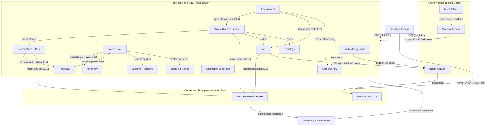

# Bounded Contexts — Canonical Context Map

**Balsm Healthcare Platform — Strategic Domain-Driven Design**

> Derived from [`Balsm-Draft/PHASED_ROADMAP.md`](../../../Balsm-Draft/PHASED_ROADMAP.md) (P000–P023), ADR-01…ADR-13, and the prior 13-context decomposition. Supersedes the 13-context list; constitution amended in the same change (Principle IV, v1.8.0).
>
> One file per context. A context is a **model boundary, not a deployment unit** — the modular monolith is the default.

---

## Organizing Principle: Three Data-Ownership Planes

ADR-10 makes data ownership architectural: the same word carries different meanings depending on who owns the data. "Record" is a patient-owned append-only ledger on the consumer plane, and an entity-owned encounter log on the provider plane. Plane boundaries are context boundaries.

| Plane | Data owner | Storage | Contexts |
|---|---|---|---|
| **Consumer** | The patient (Balsm holds zero PHI) | Local SQLite (primary) + user's Drive/iCloud (optional sync); Supabase = identity + non-PHI only | Personal Health, Provider Directory |
| **Provider** | The healthcare entity | .NET local server, SQLite per-module schema | Entity Management, Inventory, Point of Sale, Customer Relations, Appointment, Clinical Records, Prescriptions, Pharmacy, Billing & Finance, Labs, Radiology, Care Delivery, Charitable Donations |
| **Platform** | Balsm (network-level, non-PHI by design) | Balsm Cloud (PostgreSQL, multi-tenant) | Balsm Network, Platform Access, Marketplace |
| **Cross-plane** | — | per deployment | Identity & Access, Messaging & Notifications |

---

## Context Inventory (20 canonical + 2 provisional)

| # | Context | Plane | Classification | Phases | Canvas |
|---|---------|-------|----------------|--------|--------|
| 1 | Personal Health | Consumer | **Core** | P001, P002, P021 | [personal-health.md](./personal-health.md) |
| 2 | Provider Directory | Consumer | Supporting | P003, P016, P017 | [provider-directory.md](./provider-directory.md) |
| 3 | Entity Management | Provider | Supporting | P000, P005, P014 | [entity-management.md](./entity-management.md) |
| 4 | Inventory | Provider | Supporting | P006 | [inventory.md](./inventory.md) |
| 5 | Point of Sale | Provider | Supporting | P007 | [point-of-sale.md](./point-of-sale.md) |
| 6 | Customer Relations | Provider | Supporting | P008, P010 | [customer-relations.md](./customer-relations.md) |
| 7 | Appointment | Provider | Supporting | P011, P017 | [appointment.md](./appointment.md) |
| 8 | Clinical Records | Provider | **Core** | P012, P020 | [clinical-records.md](./clinical-records.md) |
| 9 | Prescriptions | Provider | **Core** | P013, P020 | [prescriptions.md](./prescriptions.md) |
| 10 | Pharmacy | Provider | Supporting | P007, P013 | [pharmacy.md](./pharmacy.md) |
| 11 | Billing & Finance | Provider | Supporting | P015 | [billing-finance.md](./billing-finance.md) |
| 12 | Labs | Provider | Supporting | P017 | [labs.md](./labs.md) |
| 13 | Radiology | Provider | Supporting | P018 | [radiology.md](./radiology.md) |
| 14 | Care Delivery | Provider | Supporting | P019 | [care-delivery.md](./care-delivery.md) |
| 15 | Charitable Donations | Provider | Supporting | P021 | [charitable-donations.md](./charitable-donations.md) |
| 16 | Balsm Network | Platform | Supporting | P009, P016 | [balsm-network.md](./balsm-network.md) |
| 17 | Platform Access | Platform | Generic | P022, P023 | [platform-access.md](./platform-access.md) |
| 18 | Marketplace | Platform | Supporting | P022 | [marketplace.md](./marketplace.md) |
| 19 | Identity & Access | Cross-plane | Generic | P001, P004, P014 | [identity-access.md](./identity-access.md) |
| 20 | Messaging & Notifications | Cross-plane | Generic | P011+ | [messaging-notifications.md](./messaging-notifications.md) |
| — | Community *(provisional)* | Platform | Supporting | P021 | [community.md](./community.md) |
| — | Population Insights *(provisional)* | Platform | Supporting | P021 | [population-insights.md](./population-insights.md) |

Provisional contexts are candidates, not canonical. They are confirmed (or dissolved into existing contexts) when the P021 spec is written. Modules may not map to a provisional context.

### New vs the prior 13

Added: Personal Health, Provider Directory, Point of Sale, Customer Relations, Care Delivery, Balsm Network, Platform Access.
Reclassified: Charitable Donations and Marketplace are Supporting (constitution already said so; `subdomain-classification.md` was stale and is corrected in this change).
Core set: Clinical Records, Prescriptions, **Personal Health** (consumer differentiation: emergency card, patient-owned records privacy story).
Entity-list fix: `PharmacyInventory` moves from Pharmacy to Inventory — one context owns stock.

---

## Context Map



## Relationship Matrix

Notation: `A → B` = A upstream, B downstream. **OHS/PL** = Open Host Service + Published Language · **C-S** = Customer-Supplier · **ACL** = downstream anti-corruption layer · **CF** = Conformist · **P** = Partnership · **SK** = Shared Kernel.

| Relationship | Pattern | Contract |
|---|---|---|
| Identity & Access → all | OHS/PL | Supabase-issued JWT (ADR-03); local server validates via cached public key (P010), offline-capable. No auth migration ever. |
| Identity & Access → Customer Relations | C-S | Claim flow: match phone/email/national ID → bind `supabase_user_id`. |
| Appointment → Clinical Records | C-S, events | `AppointmentCompleted` → encounter opened. |
| Clinical Records → Prescriptions | C-S | Prescription created inside encounter, references encounter by ID. |
| Prescriptions → Pharmacy | C-S, PL | PL = prescription QR payload + lifecycle status. Dispensing cancelled/superseded/expired is blocked; superseded redirects. Pharmacy never reads Prescriptions tables. |
| Clinical Records / Prescriptions / Labs → Personal Health | C-S + ACL | Mirror entries into the patient timeline with `external_source` discriminator (ADR-12); provider entities are translated, never imported raw. |
| Point of Sale → Inventory | C-S, sync command | `DeductStock(saleId, lines)` via published interface, in-process, single local transaction (see [point-of-sale.md](./point-of-sale.md) §Boundary decision). Inventory alone owns the never-below-zero invariant. |
| Point of Sale ↔ Pharmacy | P | Controlled-substance + QR dispensing woven into checkout; Pharmacy validates dispensation, POS owns payment/receipt. |
| Point of Sale → Customer Relations | events | `SaleCompleted` (optional customerId) → purchase history. |
| Point of Sale → Billing & Finance | events | Retail invoice snapshot → VAT reporting. Billing owns money movement + claims; POS owns counter trade. |
| Clinical Records → Labs / Radiology | C-S | Structured orders with clinical indication (free-text P012, structured P017). |
| Appointment → Labs | CF | House-visit booking reuses the slot/booking model as-is. |
| Appointment → Care Delivery | C-S | Telehealth consults are booked as appointments; Care Delivery runs the session. |
| Entity Management → Care Delivery | C-S (by ID) | Beds/rooms referenced by ID; occupancy state lives in Care Delivery. |
| Balsm Network → all cross-instance flows | OHS, gatekeeper | Nothing leaves a local instance except through the entity sharing policy (BRD §1.4). Owns entitlements/tiers (§1.7); Billing owns the money. |
| Entity Management / Labs → Provider Directory | C-S via Balsm Network | Catalog/profile publishing; the Directory stores projections, not live references. |
| Platform Access → all | OHS/PL | Patient PHI only via patient-authorized OAuth; entity API keys never grant PHI. Conforms to Balsm Network sharing policy. |
| Marketplace → Platform Access | C-S | Add-ons consume the same scoped API surface — no privileged path. |
| all → Messaging & Notifications | C-S | Contexts emit `NotificationRequested`; Messaging owns channels/delivery. No direct FCM/APNs calls from other contexts. |
| SharedKernel (.NET) / `core` (Flutter) | SK | Result, UUID v7, Money, pagination, event bus, sync plumbing (ADR-08), SQLCipher/drift setup, backup adapters. Anything domain-flavored is evicted to a context. |

## Event Rules

- Internal domain events stay inside their context. Crossing a boundary = integration event through the upstream's published language, consumed behind the downstream's ACL.
- Integration events are immutable facts, named in past tense: `PrescriptionDispensed`, `SpecimenCollected`, `EncounterFinalized`, `SaleCompleted`, `ResultReleased`, `AccountDeletionConfirmed`.
- Consumer↔provider plane crossings additionally pass the Balsm Network sharing policy from P016 onward (before P016, device↔local-server flows are direct).

## Explicit Non-Contexts

| Concept | Why not a context | Where it lives |
|---|---|---|
| AI Suite (P020) | Capability, not a model boundary | Scribe → Clinical Records; CDSS → Prescriptions; scheduling optimization → Appointment; BYOK provider gateway = generic infrastructure |
| Sync engine | Mechanism, single implementation per ADR-08 | SharedKernel/Supervisor infrastructure; *policy* lives in Balsm Network |
| Interoperability (HL7/FHIR, NPHIES, legacy import) | Each context owns its own standards boundary | Per-context ACL + FHIR published language; migration = tooling |
| Analytics (P008) | Read models, not a domain | CQRS projections inside owning contexts |
| Workspace | Single aggregate, not a context | Entity Management |

## Module → Context Mapping

Constitution Principle IV: every implemented module maps to exactly one canonical context.

### Module README convention (binding)

Every module/package carries a `README.md` whose YAML frontmatter declares its mapping — the machine-checkable source of truth:

```yaml
---
context: <exact canonical context name>   # e.g. "Identity & Access"
plane: consumer | provider | platform | cross-plane
features:                                  # roadmap deliverables this module implements
  - "P001: registration + username + social login"
---
```

Rules:

- `context` MUST be one of the 20 canonical names, or one of the sanctioned non-context values: `shared-kernel`, `infrastructure`, `app-shell`, `tooling`. Provisional contexts (Community, Population Insights) are not valid values.
- `features` entries are prefixed with their roadmap phase (`P001:`…) and stay one line each; deep detail lives in the phase spec, not the README.
- CI/lint SHOULD validate `context` against this file's inventory (Flutter: extend `balsm_boundary_lint`; .NET: quality-bar script).
- A module whose honest `context` value doesn't exist = constitution amendment trigger, not a new frontmatter value.

### Balsm-API-DotNet modules (13 in tree)

| Module | Context |
|---|---|
| `Modules/Account` | Identity & Access |
| `Modules/Auth` | Identity & Access |
| `Modules/Sessions` | Identity & Access |
| `Modules/Deletion` | Identity & Access |
| `Modules/Disclosure` | Identity & Access |
| `Modules/Geofence` | Identity & Access |
| `Modules/Identity` | Identity & Access |
| `Modules/EmergencyQr` | Personal Health |
| `Modules/Entity` | Entity Management |
| `Modules/Inventory` | Inventory |
| `Modules/POS` | Point of Sale |
| `Modules/Customer` | Customer Relations |
| `Modules/Prescription` | Prescriptions |
| `Balsm.Supervisor` (auth, certs, mDNS, tunnels, federation, sync loop) | Infrastructure host; federation/pairing/sharing-policy features map to Balsm Network; admin auth maps to Identity & Access |
| `Balsm.SharedKernel`, `Balsm.Infrastructure` | `shared-kernel` / `infrastructure` (not a context) |

### balsm_app_flutter packages

In tree: libs under `packages/` — `core` (`shared-kernel`), `balsm_api` (`infrastructure` — HTTP client layer), `balsm_boundary_lint` (`tooling`) — and P001 domain modules under `modules/`. All carry the README frontmatter mapping.

| Module | Context |
|---|---|
| `auth`, `sessions`, `account`, `deletion`, `disclosure`, `geofence_block` | Identity & Access |
| `profile`, `medications`, `emergency_card` | Personal Health |
| `app/` (composition root) | `app-shell` (orchestration, not a context) |

The former `modules/home` was folded into `app/` (2026-07-11): it was presentation-only cross-context glue (greeting, onboarding nudges, locale refresh) with no domain — app-shell's job, not a context.

### Supabase (consumer identity plane)

| Object | Context |
|---|---|
| `auth.users`, `public.profiles`, `public.deletion_log` | Identity & Access |
| `public.emergency_qr_tokens` | Personal Health (token resolution surface) |
| `public.providers` (+PostGIS) | Provider Directory |

## Phase → Context Mapping

| Phase | Primary context(s) |
|---|---|
| P000 | Entity Management, Identity & Access (+ infrastructure) |
| P001 | Identity & Access, Personal Health |
| P002 | Personal Health |
| P003 | Provider Directory, Personal Health (family profiles → Identity & Access guardianship) |
| P004 | Identity & Access |
| P005 | Entity Management (+ cross-cutting L10n) |
| P006 | Inventory |
| P007 | Point of Sale, Pharmacy |
| P008 | Customer Relations (+ CQRS read models in POS/Inventory) |
| P009 | Balsm Network (policy) + SharedKernel (plumbing, ADR-08) |
| P010 | Identity & Access (JWT bridge), Customer Relations (claim) |
| P011 | Appointment, Messaging & Notifications |
| P012 | Clinical Records |
| P013 | Prescriptions, Pharmacy |
| P014 | Identity & Access (permissions engine), Entity Management (expansion) |
| P015 | Billing & Finance |
| P016 | Balsm Network, Provider Directory, Billing & Finance (subscription money) |
| P017 | Labs, Appointment (CF), Provider Directory |
| P018 | Radiology |
| P019 | Care Delivery |
| P020 | Clinical Records, Prescriptions, Appointment (AI features in owning contexts) |
| P021 | Charitable Donations, Community*, Population Insights*, Personal Health (triage, PROs) |
| P022 | Marketplace, Platform Access (webhooks) |
| P023 | Platform Access |

## Decision Log

| Date | Decision |
|---|---|
| 2026-07-10 | Context map derived from PHASED_ROADMAP.md; 13 → 20 canonical contexts (+2 provisional); three-plane organization per ADR-10; constitution Principle IV amended (v1.8.0); `PharmacyInventory` moved Pharmacy → Inventory; stale Core classification of Charitable Donations/Marketplace corrected to Supporting. |
