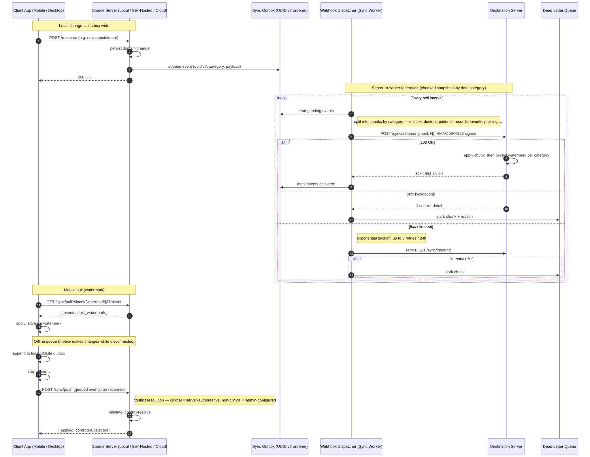

# Balsm Healthcare Platform — C4 Model

> **Purpose:** Architectural visualization using the C4 (Context, Container, Component, Code) model
> **Last Updated:** May 6, 2026
> **Source Document:** [BUSINESS_FEATURES.md](../../Balsm-Draft/BUSINESS_FEATURES.md)

---

## Table of Contents

1. [Level 1 — System Context](#level-1--system-context)
2. [Level 2 — Container Diagram](#level-2--container-diagram)
3. [Level 3 — Component Diagram (API)](#level-3--component-diagram-api)
4. [Level 4 — Code Diagram (Authentication Module)](#level-4--code-diagram-authentication-module)
5. [Deployment Views](#deployment-views)
6. [Instance-to-Instance Sync](#instance-to-instance-sync)
7. [Module × Entity-Type Access Matrix](#module--entity-type-access-matrix)

---

## Level 1 — System Context

Shows the Balsm Healthcare Platform and its relationships with external actors and systems.

[View source (.mmd)](./diagrams/c4-level1-system-context.mmd)

### Key Relationships

Each actor connects to the app dedicated to their role; the four apps share a single Backend Platform that integrates with external systems.

| Actor / System | Connects to | Purpose |
|----------------|-------------|---------|
| Patient | Balsm App | Medical records, appointments, medication orders, family/dependent management |
| Family Member / Caregiver | Balsm App | Manage dependents, delegated access, fetus profile, family billing |
| Healthcare Professional (doctor, nurse, lab tech, radiologist, pathologist) | Balsm Pro | Clinical documentation, prescriptions, scheduling, lab/imaging workflows |
| Pharmacist | Balsm Pro (Pharmacy + POS modules) | Dispensing, inventory, drug interaction checks |
| Entity Admin | Balsm Pro (Admin module) | Entity, staff, billing, data sharing controls, module activation |
| Partner Organization (Pharma, Insurance, Research) | Balsm Connect | Analytics dashboards, voucher campaigns, anonymized research datasets |
| Public Visitor | balsm.health | Provider directory, educational content, charitable cases, "Book Now" handoff |
| Third-Party Developer | Backend Platform (OAuth) | Patient-authorized apps via OAuth 2.0 + scopes + PKCE |
| Government Health Authority | Backend Platform | Automated regulatory reporting (immunization, cancer, pharmacovigilance) |
| Payment Gateway | Backend Platform | Patient payments, subscriptions, metered billing |
| AI Provider (BYOK — OpenAI, Gemini, Anthropic, Ollama, LM Studio) | Backend Platform | Drug interactions, CDSS, ambient scribing, scheduling AI; keys stored locally and never sent to Balsm |
| SMS / Email Service (Twilio, SendGrid) | Backend Platform | Notifications, OTP, reminders |
| Advertising APIs (Facebook Marketing, Google Ads) | Backend Platform | Voucher-based campaigns for professionals/entities |
| FHIR / HL7 / Legacy EHR (Epic, Cerner, Meditech) | Backend Platform | FHIR R4 import/export, legacy migration |
| DICOM / PACS | Backend Platform | Imaging studies, radiology orders |
| Insurance / NPHIES | Backend Platform | Eligibility, pre-authorization, claims |
| Government Registries | Backend Platform | Immunization registries, cancer registries, pharmacovigilance (EPVC, SFDA NPC) |
| WhatsApp / Telegram | Backend Platform | Chatbot channels for booking and inquiries |
| Printer + QR Codes | Backend Platform | Offline document exchange (print-with-QR fallback) |

---

## Level 2 — Container Diagram

Shows the high-level technology choices and how they communicate.

[View source (.mmd)](./diagrams/c4-level2-container.mmd)

### Container Details

| Container | Technology | Responsibility | Deployment |
|-----------|-----------|----------------|------------|
| **Balsm App** | Flutter (multi-platform) | Patient-facing app; multi-server connections (cloud + local concurrent) | iOS, Android, Web, macOS, Windows, Linux |
| **Balsm Pro** | Flutter (multi-platform) | Unified practice management with module-based access: POS, Pharmacy, Clinical, Inventory, Scheduling, Lab, Imaging, Admin | iOS, Android, Web, macOS, Windows, Linux |
| **Balsm Connect** | Flutter (Web) | Partner analytics, campaign management, research portal | Web only |
| **balsm.health** | Next.js, React, TypeScript | Public marketing site, provider directory, educational content, "Book Now" handoff | Vercel / CDN |
| **Backend API** | ASP.NET Core, .NET 10.0 | REST API, business logic, authentication/authorization gating, WebSocket real-time | Local, self-hosted, or Balsm Cloud |
| **Cloud Auth API** | ASP.NET Core | Identity SoT — registration, entity/workspace creation, OAuth Authorization Server | Cloud only (local fallback runs in Backend API) |
| **Database Engine** | SQLite (local), PostgreSQL (cloud) | Data persistence; **decoupled lifecycle** — backend updates never touch the engine | Embedded or cloud |
| **Admin UI** | React, Vite | Embedded admin panel | Served from API at `/admin` |
| **Sync Service** | .NET Background Worker | Outbox polling, chunked snapshot webhook delivery, watermark pull | Background process |
| **Webhook Manager** | .NET Service | Event subscriptions, HMAC signing, 5x retry / 24h, DLQ | Background process |
| **Messaging Service** | .NET Service | Patient↔doctor messaging, staff threads, attachments | Background process |
| **Notification Service** | .NET Service | SMS, email, push, in-app reminders | Background process |
| **Document Exchange Service** | .NET Service | Time-limited OTP-verified links, watermarking, LAN P2P (mDNS+TLS) | Background process |
| **Chatbot Service** | .NET Service | WhatsApp / Telegram / in-app channels; NLP via AI Abstraction Layer | Background process |
| **FHIR Mapping Service** | .NET Service | HL7 FHIR R4 import/export | In-process |
| **AI Abstraction Layer** | .NET Service | Provider-agnostic AI; BYOK keys local-only; graceful disable when unconfigured | In-process |
| **Billing Service** | .NET Service | Metered tracking, invoicing, subscriptions | Background process |
| **Server Info Endpoint** | ASP.NET endpoint | `GET /api/v1/server-info` — public, unauthenticated; pre-auth handshake from mobile | In-process |
| **mDNS Broadcaster** | .NET Service | Advertises `balsm.local` on LAN | Background process |
| **Device Registry + Invite Code System** | .NET Service | Per-device tracking, one-time-use registration codes | In-process |
| **QR Code Generator** | Admin UI feature | Encodes server URL + invite + name + version | Admin UI |
| **File Storage** | Filesystem / S3 / Azure Blob | Medical images, documents, reports; signed URLs in cloud | Local or cloud |

### Communication Patterns

- **Client → API:** REST over HTTPS, JSON payloads, JWT authentication; cloud-default + local-fallback dispatch
- **Pre-auth handshake:** mobile clients call `GET /api/v1/server-info` to verify platform, version, and capabilities before authenticating
- **Real-time:** WebSocket (SignalR) for live notifications, chat, and shift handoff updates
- **API → Database:** EF Core ORM with parameterized queries; database engine decoupled from API binary
- **API → External APIs:** HTTPS with entity-owned BYOK keys (AI keys never leave the entity's infrastructure)
- **Server-to-server sync:** Outbox + chunked snapshot HMAC-signed webhook POSTs to destination, 5x retry / 24h, DLQ
- **Mobile sync:** watermark pull (`GET /sync/pull?since=…`) + offline outbox push on reconnect
- **OAuth:** Authorization Code flow with PKCE for patient-authorized third-party apps; scoped tokens (e.g., `prescriptions.read`)
- **FHIR:** HL7 FHIR R4 resources (Patient, Observation, Condition, MedicationRequest, DiagnosticReport, Immunization, Encounter)
- **Discovery:** mDNS on `balsm.local` for LAN; QR code (URL + invite + name + version) for first-time mobile registration

---

## Level 3 — Component Diagram (API)

Shows the internal components within the Backend API container.

[View source (.mmd)](./diagrams/c4-level3-component-api.mmd)

### Component Responsibilities

#### API Layer (Controllers)
- **Server Info Controller:** `GET /api/v1/server-info` — public, unauthenticated handshake
- **Auth Controller:** Registration, login, token refresh, device management, account merge
- **OAuth Controller:** Authorization Code, token exchange, PKCE
- **Patient Controller:** Records, family/dependents, prenatal profile lifecycle
- **Appointment Controller:** Slot availability, booking, cancellation, smart matching
- **Prescription Controller:** Creation, dispensing, history, QR scanning
- **Inventory Controller:** Stock, POS transactions, expiry, low-stock alerts
- **Lab Controller:** Lab orders, specimens, result entry, reference ranges
- **Imaging Controller:** Radiology orders, DICOM, imaging reports
- **Messaging Controller:** Patient↔doctor messages, staff threads
- **FHIR Controller:** FHIR R4 import/export
- **Report Controller:** Analytics, exports, population health
- **Partner Controller:** Pharma analytics, anonymized research datasets
- **Developer API Controller:** Entity API keys, quotas, webhook subscriptions
- **Webhook Controller:** Inbound webhook receiver
- **Sync Controller:** Pull / push, watermarks, conflict resolution

#### Business Layer (MediatR Handlers)
- **Auth Handlers:** `LoginCommand`, `RegisterCommand`, `RefreshTokenCommand`, `RevokeDeviceCommand`, `AccountMergeCommand`
- **OAuth Handlers:** `AuthorizationCodeCommand`, `TokenExchangeCommand`
- **Patient Handlers:** Records, family group, delegation, prenatal lifecycle, FHIR mapping
- **Appointment Handlers:** Slot management, booking logic, smart matching
- **Prescription Handlers:** Drug validation, interaction checks (via AI)
- **Inventory Handlers:** Stock tracking, low-stock alerts
- **Lab / Imaging Handlers:** Order routing, result publication, DICOM ingestion
- **Messaging Handlers:** Threading, attachments, delivery receipts
- **Billing Handlers:** Usage metering, invoicing
- **Analytics Handlers:** Reports, exports, population health
- **Partner Analytics + Research Export Handlers:** Aggregated, anonymized, partner-scoped data; de-identified FHIR-shaped datasets
- **Sync Handlers:** Outbox processing, conflict resolution

#### Data Layer (Repositories)
- **Pattern:** Repository pattern with `IRepository<T>` interface
- **ORM:** Entity Framework Core 10.0.5
- **Queries:** Parameterized, no string concatenation, `AsNoTracking()` for reads
- **Migrations:** Reversible, version-controlled

#### Cross-Cutting Services
- **Auth Service:** JWT generation, validation, session management; cloud-default with local-fallback dispatcher
- **Permission Service:** RBAC, entity-scoped permissions, module gating
- **AI Abstraction Layer:** Provider-agnostic; BYOK keys local-only; prompt injection protection; gracefully disables unconfigured features
- **Notification Service:** SMS, email, push, in-app; queued delivery
- **Messaging Service:** Patient↔doctor and staff threading, attachments
- **Audit Service:** Immutable append-only logs, PHI access tracking, correlation IDs
- **Validation Service:** FluentValidation for commands/queries
- **Cache Service:** Redis (cloud) / in-memory (local)
- **File Service:** Upload, signed URLs, storage abstraction
- **Webhook Service:** HMAC sign, dispatch, 5x retry / 24h, DLQ
- **FHIR Mapping Service:** Resource ↔ entity mapping for HL7 FHIR R4
- **OAuth Authorization Service:** Codes, tokens, scopes, PKCE verification
- **Chatbot Service:** WhatsApp / Telegram / in-app channels; NLP via AI Abstraction Layer
- **Document Exchange Service:** Time-limited links, OTP verification, watermarking, LAN P2P (mDNS+TLS)
- **Device Registry Service:** Trust, revoke cascade (device → sessions → refresh tokens)
- **Server Discovery Service:** mDNS broadcast and `server-info` response
- **Invite Code Service:** One-time-use device registration codes

#### Background Services
- **Sync Worker:** Polls outbox, delivers chunked webhooks, handles retries
- **Billing Worker:** Aggregates usage events, generates invoices, processes payments
- **Notification Worker:** Processes notification queue, handles delivery retries
- **Webhook Outbound Worker:** Subscriber delivery, exponential backoff, DLQ

---

## Level 4 — Code Diagram (Authentication Module)

Shows class-level detail for the Authentication module as an example.

[View source (.mmd)](./diagrams/c4-level4-auth-code.mmd)

### Key Design Patterns

| Pattern | Implementation | Purpose |
|---------|---------------|---------|
| **CQRS** | MediatR with separate Command/Query handlers | Separates read and write concerns, simplifies testing |
| **Repository** | `IRepository<T>` abstraction over EF Core | Decouples data access from business logic |
| **Result** | `Result<T>` type for expected failures | Avoids exceptions for business rule violations |
| **Factory** | `TokenPair` factory methods | Encapsulates token generation logic |
| **Strategy** | `IAuthService` interface + `AuthMode` (CloudDefault / LocalFallback) | Switches between cloud auth and local fallback transparently |
| **Cascade Revocation** | Device revocation triggers session and refresh-token revocation | Single point of trust withdrawal |
| **Account Merge** | `AccountMergeCommand` + `AccountMergeCommandHandler` | Reconciles duplicate identities discovered post-registration |
| **PKCE** | `AuthorizationCodeCommand` + `TokenExchangeCommand` + `IPkceVerifier` | Mandatory for public OAuth clients |
| **One-Time Codes** | `IInviteCodeService` with consume-on-use semantics | First-time device registration on a server |
| **Lockout** | `FailedAttempts`, `LockoutUntil` on `User` | Brute-force protection (5 attempts → 15-minute cooldown) |
| **Immutable Audit** | Append-only `AuditLog` table | Compliance with PHI access tracking requirements |

---

## Deployment Views

### Local / Offline Deployment

[View source (.mmd)](./diagrams/c4-deploy-local.mmd)

**Characteristics:**
- Single workspace per server (one server = one workspace)
- No internet required for operations
- SQLite embedded; **database engine decoupled from API binary** — backend updates never touch the engine
- Local file storage
- mDNS broadcast on `balsm.local`; public `GET /api/v1/server-info`; QR-code-driven device onboarding
- Mobile clients support **multi-server connections** (e.g., this local server + Balsm Cloud concurrently)
- LAN peer-to-peer document exchange over mDNS+TLS; print-with-QR fallback
- Free tier — no Balsm Network costs

### Balsm Network (Cloud) Deployment

[View source (.mmd)](./diagrams/c4-deploy-cloud.mmd)

**Characteristics:**
- WAF + load balancer in public subnet; API + Auth + workers + DB in private subnet
- **Cloud Auth API** runs as a separate cluster (identity SoT)
- Multi-tenant architecture, horizontal scaling
- PostgreSQL primary + replica; Redis cache; S3/Azure Blob with KMS encryption and signed URLs
- Webhook Outbound Worker delivers HMAC-signed POSTs to subscribers (5x retry / 24h, DLQ)
- Secrets Manager holds API credentials; **BYOK AI keys are never stored centrally**
- Observability: logs, metrics, OTel traces
- Paid subscription required
- Cross-entity discovery and booking

### Self-Hosted Remote with Federation

[View source (.mmd)](./diagrams/c4-deploy-self-hosted.mmd)

**Characteristics:**
- Entity owns and manages server; one workspace per server
- Full data sovereignty; admin controls **opt-in data sharing** per category (doctor profiles, services, pricing, slots, inventory)
- Federation requires a paid Balsm Network subscription
- Federation protocol = chunked-snapshot HMAC-signed webhook POSTs (5x retry / 24h)
- PostgreSQL or SQLite (admin choice); database engine decoupled from API
- Public `GET /api/v1/server-info` for mobile pre-auth handshake
- Mobile clients support multi-server connections (entity server + cloud concurrently)
- Entity responsible for backups, updates
- Free for local operations, paid for network features

---

## Instance-to-Instance Sync

Sequence diagram for the chunked-snapshot webhook sync used between Balsm servers (local ↔ self-hosted ↔ cloud), plus mobile pull/push and offline queueing.

[View source (.mmd)](./diagrams/c4-sync-instance.mmd)

**Key flows:**
- **Outbox write** — every domain change appends an event (UUID v7) to the source server's outbox
- **Chunked dispatch** — the Sync Worker splits pending events into chunked snapshots by data category (entities, doctors, patients, records, inventory, billing, …) and POSTs each chunk to the destination with HMAC-SHA256 signing
- **Retry & DLQ** — destination 4xx parks immediately; 5xx/timeouts retry with exponential backoff up to 5 attempts in 24 hours, then DLQ
- **Watermarks** — destination persists the last applied UUID per category; mobile clients use `GET /sync/pull?since={watermark}` for incremental sync
- **Offline queue** — mobile clients append local changes to a SQLite outbox while disconnected and push them on reconnect via `POST /sync/push`
- **Conflict resolution** — clinical data is server-authoritative; non-clinical conflicts are resolved per the entity admin's configured policy (source-wins / dest-wins / manual review)

> **Note:** The SVG render is regenerated separately; the `.mmd` source is authoritative for this revision.

---

## Module × Entity-Type Access Matrix

Visualises which Pro modules are enabled by each entity type, and which permission groups are granted access to each module by default.

[View source (.mmd)](./diagrams/c4-module-entity-matrix.mmd)

**How to read it:**
- **Solid edges** (entity type → module) — the module is enabled for that entity type
- **Dashed edges** (permission group → module) — the group has default access to that module (label indicates the scope: full, view, financial reports only, etc.)
- **Tier labels** on modules indicate the access tier per Section 1.7 of `BUSINESS_FEATURES.md` (Free, Trial, Freemium, Paid, Add-on, Metered)

**Entity → module summary:**
- **Pharmacy** → POS, Pharmacy, Inventory, Admin
- **Medical Supply Store** → POS, Inventory, Admin
- **Clinic** → Clinical, Scheduling, Inventory, Admin
- **Hospital** → all 8 modules
- **Lab** → Lab, Scheduling, Inventory, Admin
- **Scan Center** → Imaging, Scheduling, Inventory, Admin
- **Hybrid (Pharmacy + Medical Supply)** → POS, Pharmacy, Inventory, Admin

> **Note:** The SVG render is regenerated separately; the `.mmd` source is authoritative for this revision.

---

## Technology Stack Summary

### Frontend

| App | Framework | Platforms | State Management |
|-----|-----------|-----------|------------------|
| Balsm, Balsm Pro | Flutter 3.x | iOS, Android, Web, macOS, Windows, Linux | Riverpod / BLoC |
| Balsm Connect | Flutter (Web) | Web only | Riverpod / BLoC |
| balsm.health | Next.js 14, React 18, TypeScript | Web | React Context / Zustand |
| Admin UI | React 18, Vite | Embedded in API at `/admin` | React Context |

### Backend

| Component | Technology | Purpose |
|-----------|-----------|---------|
| API Framework | ASP.NET Core 10.0 | REST API, WebSocket (SignalR), Middleware |
| ORM | Entity Framework Core 10.0.5 | Data access, migrations |
| Database (Local) | SQLite (WAL mode) | Embedded, zero-config, single-file |
| Database (Cloud) | PostgreSQL 15+ | Multi-tenant, horizontal scaling |
| Messaging | MediatR 14.1 | CQRS command/query handlers |
| Validation | FluentValidation 12.1 | Request validation, business rules |
| Logging | Serilog 10.0 | Structured logging, sinks (file, cloud) |
| Monitoring | Sentry SDK | Error tracking, performance monitoring |
| Cache | Redis (cloud), In-Memory (local) | Session store, distributed cache |
| Background Jobs | .NET Hosted Services | Sync worker, billing, notifications |

### Infrastructure

| Deployment | Hosting | Database | Storage |
|------------|---------|----------|---------|
| **Local/Offline** | Desktop/on-premise | SQLite | Local filesystem |
| **Self-Hosted** | Entity's servers/VPS | PostgreSQL or SQLite | Local or private S3-compatible |
| **Balsm Network (Cloud)** | AWS / Azure | PostgreSQL (managed) | S3 / Azure Blob |

---

## Security Architecture Highlights

### Authentication & Authorization
- **JWT-based authentication** — short-lived access tokens (15 min), long-lived refresh tokens (30 days)
- **Device tracking** — every authenticated device is registered and tracked
- **Multi-device support** — users can be logged in from multiple devices simultaneously
- **Revocation** — entity admin can revoke any device or session remotely
- **Session isolation** — tokens are bound to device ID, cannot be reused across devices
- **Brute-force protection** — account lockout after 5 failed attempts (15-minute cooldown)

### Data Protection
- **Encryption at rest** — database encryption, encrypted file storage
- **Encryption in transit** — TLS 1.3 for all external connections, local network allows HTTP only for private IPs
- **PHI access auditing** — every access to patient data is logged (immutable audit log)
- **Role-based access control (RBAC)** — granular permissions, entity-scoped
- **Soft delete** — no hard deletes for clinical data, records are marked inactive

### AI Security (BYOK Model)
- **Prompt injection protection** — user input is structurally separated from system prompts
- **Context isolation** — AI sessions are scoped to single user and entity, flushed on session end
- **Output validation** — AI responses are validated against expected schema
- **Audit trail** — all AI interactions logged with prompt hash, response hash, model ID
- **No Balsm proxy** — entity's API keys never leave their infrastructure

---

## Appendix: Key Design Decisions

### Why SQLite for Local Deployments?
- **Zero configuration** — no separate database server to install or manage
- **Single file** — entire database is one file, easy to backup and migrate
- **ACID compliant** — full transactional support with WAL mode
- **Cross-platform** — works identically on Windows, macOS, Linux
- **Sufficient for entity scale** — handles 100+ concurrent users with proper indexing
- **Upgrade path** — can migrate to PostgreSQL without code changes (same EF Core queries)

### Why Flutter for All Client Apps?
- **Single codebase** — write once, deploy to iOS, Android, Web, Desktop (6 platforms)
- **Native performance** — compiled to native ARM/x64 code
- **Hot reload** — fast development iteration
- **Rich UI** — Material Design and Cupertino widgets, custom theming
- **Offline-first** — built-in support for SQLite local storage
- **Mature ecosystem** — 30,000+ packages on pub.dev

### Why ASP.NET Core for Backend?
- **Performance** — top-tier performance on TechEmpower benchmarks
- **Cross-platform** — runs on Windows, macOS, Linux (Docker)
- **Async-first** — native async/await, excellent for I/O-bound workloads
- **Strong typing** — C# type system prevents entire classes of bugs
- **EF Core** — mature ORM with migrations, LINQ queries
- **Dependency injection** — built-in DI container, testable architecture
- **SignalR** — WebSocket support for real-time features
- **Minimal API** — lightweight endpoints for simple routes, full MVC for complex

### Why MediatR (CQRS)?
- **Separation of concerns** — controllers are thin, handlers contain business logic
- **Testability** — handlers are easily unit tested in isolation
- **Pipeline behaviors** — validation, logging, caching as cross-cutting concerns
- **Request/response pattern** — explicit command/query types, no magic strings

### Why `Result<T>` Instead of Exceptions?
- **Expected failures are not exceptional** — business rule violations are part of normal flow
- **Performance** — no stack unwinding overhead
- **Explicitness** — API contract clearly shows success and failure cases
- **Railway-oriented programming** — compose operations cleanly

---

## Glossary

| Term | Definition |
|------|------------|
| **Container** | A deployable unit (app, service, database) that executes code or stores data |
| **Component** | A grouping of related functionality within a container (e.g., AuthService, PatientRepository) |
| **BYOK** | Bring Your Own Key — entity provides their own API keys for third-party services (AI, SMS) |
| **CQRS** | Command Query Responsibility Segregation — separate read and write operations |
| **PHI** | Protected Health Information — patient medical data subject to privacy regulations |
| **Outbox Pattern** | Reliable message delivery via database-backed queue, prevents lost messages |
| **UUID v7** | Time-ordered UUID variant that improves database index performance |
| **Soft Delete** | Records are marked inactive rather than physically deleted from the database |
| **RBAC** | Role-Based Access Control — permissions granted based on user roles |
| **Multi-tenant** | Single application instance serves multiple isolated entities (workspaces) |

---

## Related Documents

- [BUSINESS_FEATURES.md](../../Balsm-Draft/BUSINESS_FEATURES.md) — Full business requirements
- [AI_GOVERNANCE.md](../AI_GOVERNANCE.md) — AI safety and governance framework
- [AI_THREAT_MODELS.md](../AI_THREAT_MODELS.md) — Security threat catalog for AI features
- [authentication-routing-strategy.md](./authentication-routing-strategy.md) — Auth routing patterns
- [subdomain-map.md](./subdomain-map.md) — Network subdomain architecture

---

**Document Status:** ✅ Complete
**Diagrams:** Mermaid (render in VS Code with Markdown Preview, GitHub, or mermaid.live)
**Maintenance:** Update this document when major architectural changes occur (new containers, deployment modes, or technology stack changes)
